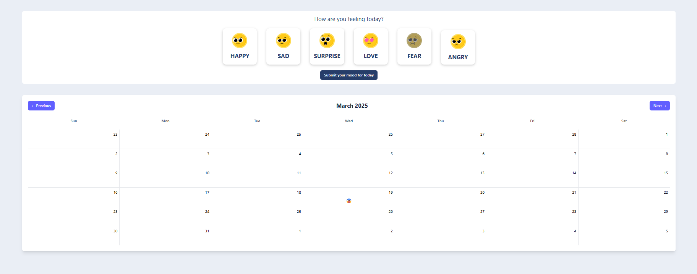

# Daily Mood Tracker

A simple web application that allows you to track your daily mood and visualize it on a calendar.

## Features

- Select from six different mood options (happy, sad, surprise, love, fear, angry)
- Save your mood for each day
- View your mood history on an interactive calendar
- Navigate between months to see your mood patterns over time
- Responsive design that works on mobile and desktop devices
- Data persists in your browser's local storage

## Technologies Used

- HTML5
- CSS3
- JavaScript (ES6+)
- Tailwind CSS for styling
- Local Storage API for data persistence

## Setup Instructions

1. Clone the repository:

```bash
git clone [https://github.com/prateek3422/mood-traker.git]
cd mood-traker
```

2. Open the project in your preferred code editor.

## How to Use

1. When you open the application, you'll see the current month's calendar and a mood selection panel.
2. Select how you're feeling today by clicking on one of the mood icons.
3. Click "Submit your mood for today" to save your selection.
4. Your mood will appear as an emoji on the calendar for the current day.
5. Use the "Previous" and "Next" buttons to navigate between months and view your mood history.

## Project Structure

- `index.html` - Main HTML structure of the application
- `style.css` - Custom styles for the application
- `script.js` - JavaScript code that handles the application logic
- `images/` - Directory containing mood icons

## Screenshots


